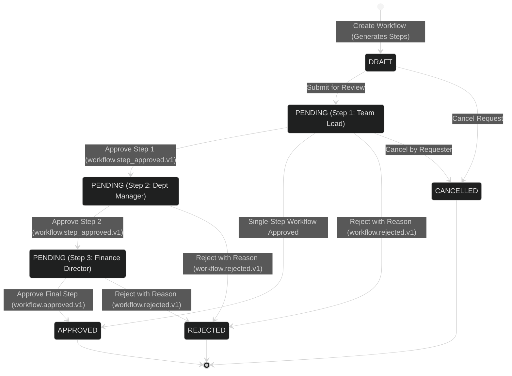
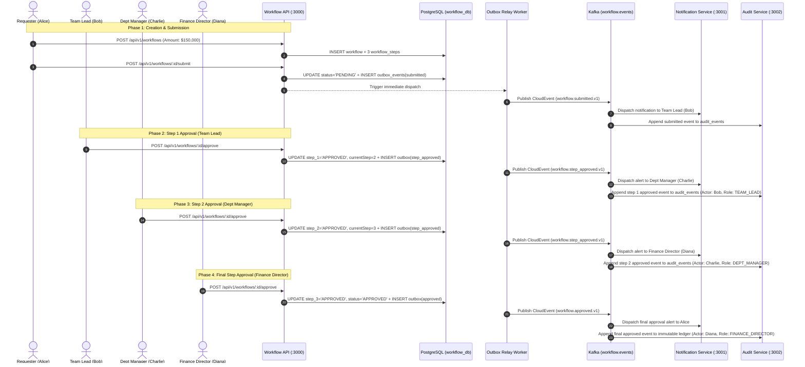
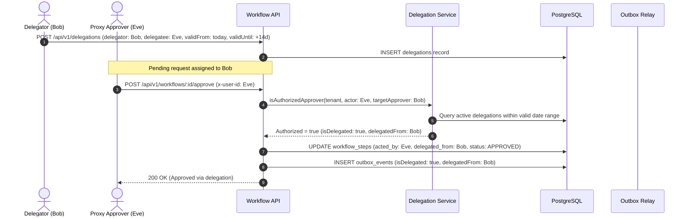
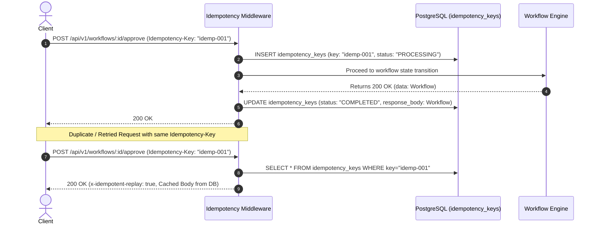
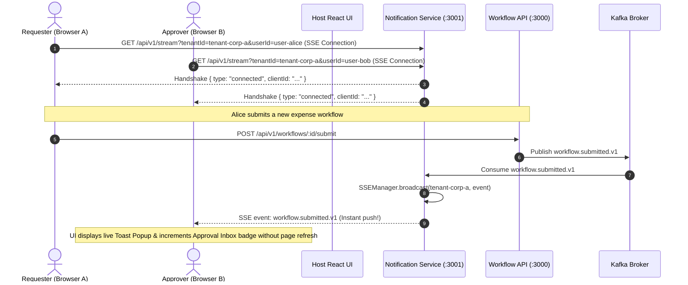
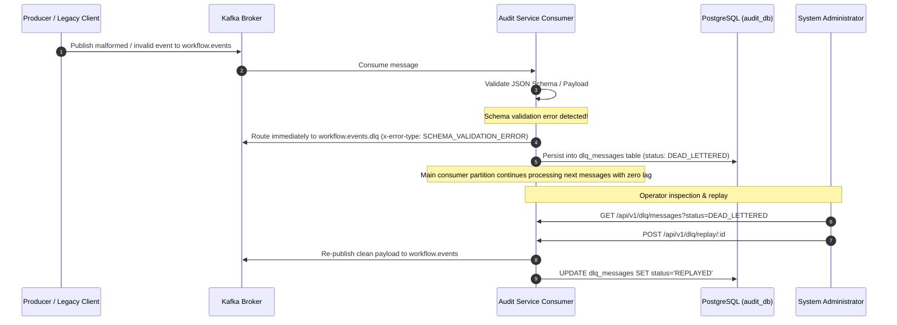
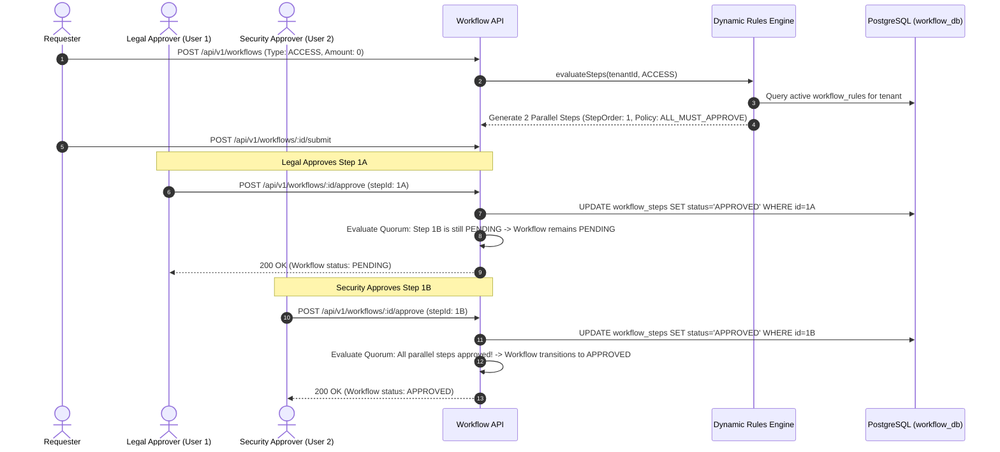
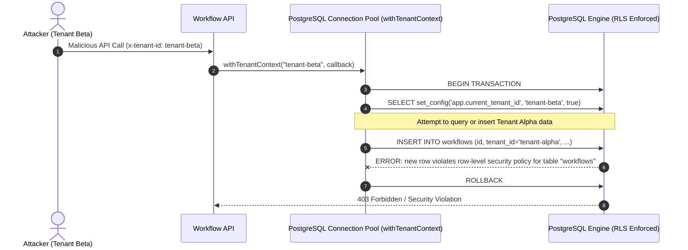
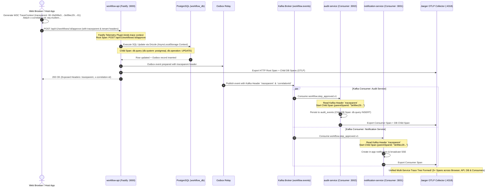

# Workflow Platform — Architecture & End-to-End Workflow Walkthrough

This document provides a comprehensive, visual, step-by-step walkthrough of the **Event-Driven Multi-Tenant Workflow Platform**. It explains the system architecture, transactional resilience, security model, and detailed end-to-end user flows for all supported business scenarios.

---

## 1. System Architecture Overview

The platform is designed as an event-driven, multi-tenant microservices ecosystem. It decouples synchronous HTTP requests (Fastify) from asynchronous event handlers (Notification and Audit services) via **Apache Kafka** partitioned by tenant and workflow ID, with a **Transactional Outbox** pattern guaranteeing zero message loss.

```mermaid
%%{init: {'theme': 'dark', 'flowchart': {'useMaxWidth': false, 'htmlLabels': true, 'nodeSpacing': 40, 'rankSpacing': 40}, 'themeVariables': {'fontSize': '16px', 'fontFamily': 'Inter, sans-serif'}}}%%
flowchart TB
    subgraph Frontend["Frontend Layer"]
        HostApp["Host React Application (Port 5173)\nMulti-Step Expenses, Approvals, Audit & Notifications"]
        Widget["Workflow Widget Web Component (Port 3003)\nEncapsulated Multi-Step State Machine UI"]
        HostApp -->|Embeds| Widget
    end

    subgraph API_Layer["API Gateway & Core Service"]
        TenantMW["Tenant & Correlation Middleware\n(x-tenant-id, x-correlation-id, x-user-id)"]
        IdempMW["Idempotency Middleware\n(Idempotency-Key deduplication)"]
        WorkflowAPI["Workflow API Service (Fastify, Port 3000)\nDynamic Multi-Step Engine & Delegations"]
        Widget -->|REST HTTP + Headers| TenantMW
        HostApp -->|REST HTTP + Headers| TenantMW
        TenantMW --> IdempMW
        IdempMW --> WorkflowAPI
    end

    subgraph Persistence["Storage, Outbox & Messaging"]
        PostgresWorkflow[("PostgreSQL: workflow_db\n(workflows, workflow_steps, delegations, outbox_events)")]
        OutboxRelay["Outbox Relay Service\nBackground Reliable Publisher"]
        KafkaCluster{{"Apache Kafka Broker (Port 9092)\nTopic: workflow.events\nKey: tenantId:workflowId"}}
        SchemaRegistry["Schema Registry (Port 8081)\nCloudEvents 1.0 JSON Schemas"]

        WorkflowAPI -->|Transactional ACID Writes| PostgresWorkflow
        PostgresWorkflow -.->|Poll Unpublished Events| OutboxRelay
        OutboxRelay -->|Publish CloudEvents| KafkaCluster
        KafkaCluster -.->|Validate Schema| SchemaRegistry
    end

    subgraph Consumers["Asynchronous Event Consumers"]
        NotifService["Notification Service (Port 3001)\nConsumer Group: notification-service-group\nDeduplication & Alert Dispatcher"]
        AuditService["Audit Service (Port 3002)\nConsumer Group: audit-service-group\nImmutable Compliance Ledger"]
        PostgresAudit[("PostgreSQL: audit_db\n(audit_events table)")]

        KafkaCluster -->|Consume with traceparent| NotifService
        KafkaCluster -->|Consume with traceparent| AuditService
        AuditService -->|Persist Idempotently| PostgresAudit
    end

    subgraph Observability["Observability & Tracing Infrastructure"]
        Jaeger["Jaeger Tracing UI (Port 16686)\nOTLP HTTP Exporter (:4318)"]
        Prometheus["Prometheus Server (Port 9090)\nScrapes GET /metrics (:3000, :3001, :3002)"]
        KafkaUI["Kafka UI (Port 8085)"]
        PactBroker["Pact Broker (Port 9292)"]

        WorkflowAPI -.->|Export Spans (OTLP)| Jaeger
        NotifService -.->|Export Spans (OTLP)| Jaeger
        AuditService -.->|Export Spans (OTLP)| Jaeger
        Prometheus -.->|Scrape /metrics| WorkflowAPI
        Prometheus -.->|Scrape /metrics| NotifService
        Prometheus -.->|Scrape /metrics| AuditService
        KafkaCluster -.-> KafkaUI
    end

    HostApp -.->|Poll Notifications| NotifService
    HostApp -.->|Query Audit Trail| AuditService
```

---

## 2. Dynamic Multi-Step Workflow State Machine

The platform supports both single-step and tiered multi-step approval hierarchies based on financial thresholds (e.g. `< 10,000` = Team Lead; `10,000 - 100,000` = Team Lead $\rightarrow$ Dept Manager; `> 100,000` = Team Lead $\rightarrow$ Dept Manager $\rightarrow$ Finance Director) or custom step definitions:



---

## 3. End-to-End User Flows by Scenario

---

### 🟢 Case 1: Multi-Step Approval Flow (Happy Path)

**Business Goal**: An employee submits a major infrastructure expense ($150,000). The platform enforces a 3-step approval chain (Team Lead $\rightarrow$ Dept Manager $\rightarrow$ Finance Director).



---

### 🟡 Case 2: Out-of-Office Delegation & Proxy Approval

**Business Goal**: Manager Bob is out of office and delegates approval authority to Proxy Colleague Eve.



---

### 🔒 Case 3: Dual-Write Resilience (Transactional Outbox Pattern)

**Business Goal**: Guarantee that database state changes and Kafka events are 100% consistent, even during network splits or Kafka broker crashes.

```mermaid
sequenceDiagram
    autonumber
    participant Client
    participant API as Workflow API
    participant DB as PostgreSQL
    participant Relay as Background Outbox Relay
    participant Kafka as Apache Kafka Broker

    Client->>API: POST /api/v1/workflows/:id/approve
    rect rgb(20, 50, 80)
        Note over API,DB: Single Atomic Database Transaction
        API->>DB: BEGIN TRANSACTION
        API->>DB: UPDATE workflows SET status='APPROVED'
        API->>DB: INSERT INTO outbox_events (payload: CloudEvent, published: FALSE)
        API->>DB: COMMIT TRANSACTION
    end
    API-->>Client: 200 OK (Immediate responsive client return)
    
    Note over Relay,Kafka: Kafka Broker Temporarily Down (Simulated Chaos)
    Relay->>DB: SELECT * FROM outbox_events WHERE published=FALSE
    Relay--xKafka: Attempt publish -> Connection Timeout!
    Relay->>DB: UPDATE outbox_events SET retry_count=retry_count+1, last_error='ECONNREFUSED'
    
    Note over Relay,Kafka: Kafka Recovers -> Outbox Drains
    Relay->>Kafka: Retry publish -> SUCCESS
    Relay->>DB: UPDATE outbox_events SET published=TRUE, published_at=NOW()
```



---

### 🛡️ Case 4: Idempotency Key & Concurrent Conflict Protection

**Business Goal**: Prevent duplicate financial approvals or double-submissions caused by client retries or network double-clicks.



---

### 📡 Case 5: Real-Time Live Sync (Server-Sent Events / SSE)

**Business Goal**: Instant, zero-polling reactive UI updates for approvers and requesters across browser tabs.



---

### 🚨 Case 6: Kafka Dead Letter Queue (DLQ) & Poison-Pill Isolation

**Business Goal**: Prevent malformed messages or schema violations from blocking consumer group partitions or halting downstream workflow processing.



---

### 🔀 Case 7: Configurable Workflow Rules & Parallel Approvals (AND/OR Quorums)

**Business Goal**: Tenant-configurable multi-approver routing supporting both unanimous AND quorums and first-responder OR quorums.



---

### 🛡️ Case 8: PostgreSQL Row-Level Security (RLS) Database Hardening

**Business Goal**: Engine-level tenant isolation preventing cross-tenant data access even if application queries omit `WHERE tenant_id = ...`.



---

## 4. Multi-Tenant Security & Isolation Architecture

Every API request is evaluated under strict multi-layer tenant boundary enforcement:
1. **Header Ingestion**: `x-tenant-id` header is extracted and validated in `tenantMiddleware`. Missing header results in `400 MISSING_TENANT_ID`.
2. **PostgreSQL Row-Level Security (RLS)**: `FORCE ROW LEVEL SECURITY` enforced across all tables. Queries and mutations execute within scoped transactions using `withTenantContext` with `app.current_tenant_id`.
3. **Application Query Scoping**: All SQL queries include explicit `WHERE tenant_id = :tenantId`.
4. **Kafka Partition Keys**: All Kafka event messages are keyed by `tenantId:workflowId` ensuring strict ordering per tenant workflow partition.
5. **Consumer Deduplication**: `notification-service` and `audit-service` enforce tenant-scoped idempotency tables to ignore duplicate event deliveries.

---

## 5. Immutable Audit Trail & CloudEvents Compliance Lifecycle

Every action across a workflow's lifecycle is published as a versioned **CloudEvents 1.0** record, validated against JSON Schemas, and persisted to `audit_db.audit_events`:

| Event Type | Trigger | Key Data Fields | Audit UI Badge & Details |
|---|---|---|---|
| `workflow.submitted.v1` | Employee submits draft | `workflowId`, `tenantId`, `amount`, `requesterId`, `requesterName` | Shows initial submission timestamp & requester |
| `workflow.step_approved.v1` | Approver reviews intermediate step | `workflowId`, `actorId`, `currentStepOrder`, `totalSteps`, `stepRole`, `comment`, `isDelegated` | `Step X of Y (ROLE)` badge + approver comment |
| `workflow.approved.v1` | Final approver completes workflow | `workflowId`, `actorId`, `currentStepOrder`, `totalSteps`, `stepRole`, `comment` | Final `APPROVED` badge + approver comment |
| `workflow.rejected.v1` | Approver rejects workflow | `workflowId`, `actorId`, `currentStepOrder`, `rejectionReason` | `REJECTED` badge + mandatory rejection reason |
| `workflow.cancelled.v1` | Requester cancels request | `workflowId`, `actorId`, `comment` | `CANCELLED` badge + cancellation note |

---

## 6. End-to-End Distributed Tracing & W3C Context Propagation

Distributed tracing connects client browser user actions, synchronous Fastify HTTP APIs, asynchronous PostgreSQL/Drizzle database queries, and Apache Kafka consumers into unified end-to-end trace graphs:



---

## 7. Live Service Endpoints & Management Matrix

| Component / Tool | Port (Local / K8s) | Working URL | Description |
|---|---|---|---|
| **Host Application (React + Vite)** | `5173` / `8080` | [http://localhost:8080](http://localhost:8080) | Main UI: Real-Time SSE Sync, Expenses, Parallel Approvals, Audit Log & W3C Tracing |
| **Workflow API** | `3000` | [http://localhost:3000/ready](http://localhost:3000/ready) | Fastify REST API: Dynamic Rules (`/api/v1/rules`), Deep Probes (`/health/live`, `/health/ready`) & Outbox Relay |
| **Notification Service** | `3001` | [http://localhost:3001/health](http://localhost:3001/health) | Kafka consumer, alerts API & SSE live stream (`/api/v1/stream`) |
| **Audit Service** | `3002` | [http://localhost:3002/health](http://localhost:3002/health) | Kafka consumer, immutable audit trail & DLQ Replay API (`/api/v1/dlq/messages`) |
| **Grafana Dashboards** | `3005` | [http://localhost:3005](http://localhost:3005) | Provisioned Dashboards: System Health, DB Pool & Outbox Reliability |
| **Kafka Web UI** | `8085` | [http://localhost:8085](http://localhost:8085) | Real-time Kafka topic inspector, DLQ monitor & consumer group lag viewer |
| **Jaeger Distributed Tracing** | `16686` | [http://localhost:16686](http://localhost:16686) | Visual distributed trace explorer (OTLP receiver on `:4318`) with DB query spans |
| **Prometheus Server** | `9090` | [http://localhost:9090](http://localhost:9090) | Prometheus metrics dashboard & alerting rules (scrapes `/metrics`) |
| **PostgreSQL Database** | `5433` | `localhost:5433` | Databases: `workflow_db`, `audit_db` (RLS Enforced, User: `postgres`, Pass: `postgres`) |

---

## 8. Fast Kubernetes Redeployment & Hot-Reload Shortcuts

| Command / Shortcut | Target | Duration | Description |
|---|---|---|---|
| `npm run k8s:reload:ui` | Frontend (`host-app`) | **~3 seconds** | Compiles Vite locally and syncs directly into running NGINX pods via `kubectl cp` with zero downtime |
| `npm run k8s:reload:api` | Backend (`workflow-api`) | **~15 seconds** | Rebuilds TypeScript backend, imports into containerd, and triggers rolling restart |
| `npm run k8s:reload` | Full Cluster | **~45 seconds** | Rebuilds all services (`host-app`, `workflow-api`, `notification-service`, `audit-service`) and restarts pods |
| `.\k8s\local\start-port-forwards.ps1` | All Port-Forwards | **~1 second** | Starts background tunnels for all microservices, UI, Grafana, Kafka UI, and PostgreSQL |
| `.\k8s\local\stop-port-forwards.ps1` | All Port-Forwards | **~1 second** | Stops all active `kubectl port-forward` background processes cleanly |

---

## 9. Data Cleanup & Testing Reset (Start Afresh)

| Command / Script | Scope | Downtime | What Gets Cleared |
|---|---|---|---|
| `npm run k8s:reset:data`<br>`.\k8s\local\reset-data.ps1`<br>`./k8s/local/reset-data.sh` | **Fast Reset** | **~1s (Instant)** | Truncates all tables in `workflow_db` and `audit_db`, and automatically purges Kafka topic (`workflow.events`) messages. |
| `npm run k8s:reset:hard`<br>`.\k8s\local\reset-data.ps1 -HardReset`<br>`./k8s/local/reset-data.sh --hard` | **Hard Reset** | **~15s** | Deletes `postgres-pvc`, wipes disk volume, re-applies manifests with fresh databases, and restarts backend services. |
| `docker compose down -v` | **Compose Reset** | **~5s** | Drops all Docker volumes (`postgres-data`, `kafka-data`) for fresh local Docker Compose startup. |

---

## 10. Verification & Test Suite Summary

The entire platform architecture is validated with automated tests:
* **Contract Tests**: Fastify route OpenAPI/Pact contracts and CloudEvents JSON Schema validation (`schema-compatibility.test.ts`).
* **Unit Tests**: Multi-step state machine, dynamic rules engine, parallel quorum evaluation, SSE manager, outbox relay logic, StructuredLogger, DB query spans, client W3C tracing, and Deep Health probes.
* **Integration Tests**: Kafka consumer message processing, DLQ poison-pill isolation, and idempotency deduplication (`kafka-events.test.ts`, `kafka-dlq.integration.test.ts`, `workflow-lifecycle.integration.test.ts`).
* **Security Tests**: Multi-tenant isolation test matrix and PostgreSQL Row-Level Security (RLS) enforcement suite (`tenant-isolation.test.ts`, `postgres-rls.test.ts`).

Run the automated test suite with:
```bash
npm test
```
*(95 tests passed across 19 test suites).*


