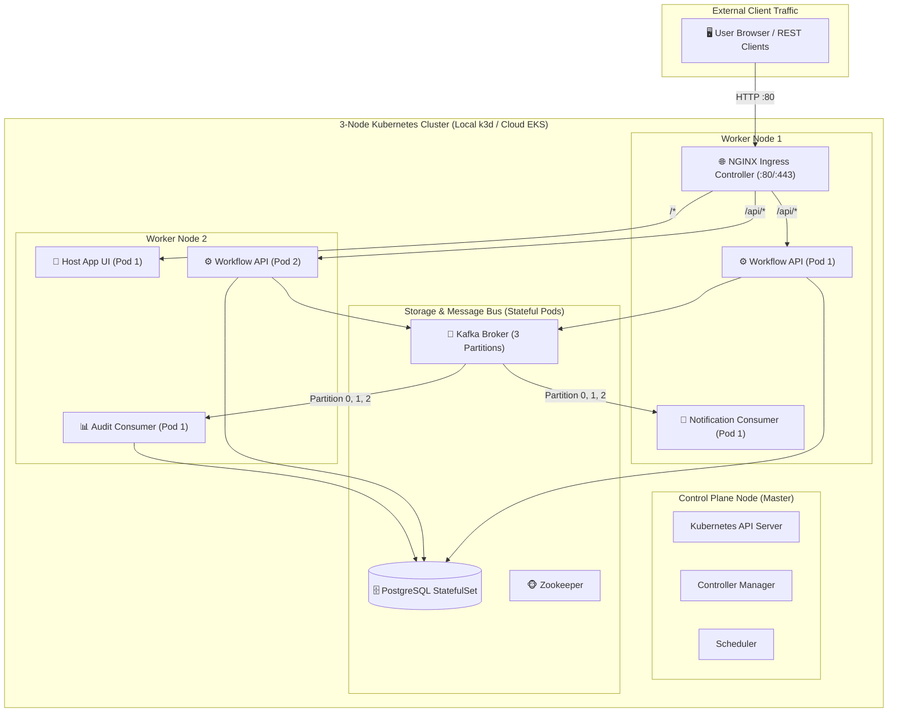

# 🌐 Multi-Node Distributed Architecture & Deployment Guide

This guide details the transition from single-node local development to a production-grade, multi-node distributed Kubernetes architecture. It covers local multi-node simulation (via **Kind** / **k3d**), key distributed engineering patterns, and cloud deployment on **AWS EKS**, **GCP GKE**, or **Azure AKS**.

---

## 🏗️ Multi-Node Cluster Topology



---

## 🏛️ Core Architectural Pillars for Multi-Node Systems

When transitioning from a single machine to a multi-node distributed cluster, 8 architectural layers evolve:

### 1. Compute & Pod Orchestration
* **Resource Requests & Limits:** Explicit CPU and Memory bounds (`requests: cpu: 100m, memory: 128Mi` / `limits: cpu: 500m, memory: 512Mi`) prevent container starvation on shared worker nodes.
* **Probes:**
  * `livenessProbe` (`GET /health`): Automatically restarts deadlocked or crashed containers.
  * `readinessProbe` (`GET /ready`): Verifies database and Kafka connectivity before routing live traffic.
* **Horizontal Pod Autoscaling (HPA):** Dynamically scales `workflow-api` between 2 and 10 replicas based on CPU load (70% utilization target).
* **Pod Disruption Budgets (PDB):** Guarantees minimum pod availability during node drain, rolling updates, or maintenance.

### 2. Ingress, Routing & API Gateway
* **Ingress Controller / API Gateway:** Replaces direct localhost calls with an Ingress Controller (e.g., NGINX, Traefik, AWS ALB) or API Gateway (Kong, Envoy).
* **Unified Path Routing:**
  * `/api/*` and `/health` $\rightarrow$ `workflow-api:3000`
  * `/*` $\rightarrow$ `host-app:80`
* **TLS & CORS:** Managed TLS termination (`cert-manager` with Let's Encrypt) and environment-configured CORS headers.

### 3. Kafka & Distributed Event Streaming
* **Multi-Partition Topics:** The `workflow.events` topic is provisioned with 3+ partitions. Kafka assigns partition subsets across multiple consumer replicas (`notification-service` and `audit-service`) for parallel event processing.
* **Partition Key Consistency:** Events are partitioned using `workflow_id` or `tenant_id` as the message key. This guarantees that events for any single workflow instance remain strictly sequential, even across a multi-broker cluster.
* **Broker Clustering & Replication:** In cloud environments, use 3 Kafka brokers with `replication.factor: 3` and `min.insync.replicas: 2` to tolerate broker failures without data loss.

### 4. Database & Persistence Layer
* **Managed Multi-AZ Storage:** Migrate from local Docker volumes to cloud-managed PostgreSQL (e.g., AWS RDS Multi-AZ / Aurora) with automated failover and read replicas.
* **Connection Pooling:** In multi-node setups where 10+ API replicas run concurrently, connection pooling (PgBouncer or AWS RDS Proxy) prevents exhausting database connection limits.
* **Decoupled Migrations:** Database schema updates run as pre-deployment Kubernetes `Jobs` or in the CI/CD pipeline rather than during container startup.

### 5. Concurrency, Locking & Idempotency
* **Idempotent Consumers:** Kafka operates on *at-least-once* delivery. Consumer services use unique event IDs and database transaction constraints (`ON CONFLICT DO NOTHING`) to safely discard duplicate event deliveries.
* **Distributed Locking:** When multiple API pods process requests for the same workflow concurrently, optimistic locking (version columns) or row locks (`SELECT ... FOR UPDATE`) prevent race conditions.

### 6. Observability & Distributed Tracing
* **OpenTelemetry (OTel) Tracing:** Injects W3C `traceparent` headers into HTTP requests and Kafka message headers. This connects a user action in `host-app` $\rightarrow$ `workflow-api` $\rightarrow$ Kafka $\rightarrow$ `notification-service` $\rightarrow$ `audit-service` into a single traceable transaction in Jaeger or AWS X-Ray.
* **Centralized Logging:** Container stdout/stderr is collected by FluentBit/Vector across all nodes and shipped to Loki or Elasticsearch.
* **Prometheus & Grafana:** Monitors API request rates, P95/P99 latency, and Kafka consumer group lag across partitions.

### 7. Configuration, Secrets & Network Security
* **Externalized Secrets:** Credentials (DB passwords, admin tokens) are mounted as Kubernetes `Secrets` from Vault or AWS Secrets Manager.
* **Network Isolation:** Kubernetes `NetworkPolicies` or AWS Security Groups restrict database and broker access strictly to authorized backend pods.
* **Mutual TLS (mTLS):** Enforce encrypted pod-to-pod communication using a service mesh (Istio / Linkerd / Cilium).

### 8. Architectural Comparison Matrix

| Component | Single-Node (Local Dev) | Multi-Node Distributed (Production) |
|---|---|---|
| **Runtime** | Docker Compose on 1 machine | Kubernetes (EKS / GKE / K3s) |
| **API Scale** | 1 process on port 3000 | 2–10 Pods with Horizontal Pod Autoscaler |
| **Ingress** | Direct port mapping (`localhost:5173`) | Ingress Controller / API Gateway + TLS |
| **Kafka** | 1 Broker, 1 Partition | 3 Brokers, 3+ Partitions, Multi-AZ |
| **Database** | Local container + volume | Managed Multi-AZ RDS + PgBouncer pooler |
| **Consumer Scaling** | 1 consumer per service | Multiple consumers sharing partitions |
| **Tracing / Logs** | `docker compose logs` | OpenTelemetry + Jaeger + Loki |
| **Secrets** | Local `.env` / `docker-compose.yml` | AWS Secrets Manager / HashiCorp Vault |

---

## 📋 Directory Layout

```text
k8s/
├── 00-namespace.yaml             # Isolated 'workflow-platform' namespace
├── 01-configmaps-secrets.yaml    # Environment variables & DB credentials
├── 02-postgres.yaml              # PostgreSQL StatefulSet & Persistent Volumes
├── 03-kafka.yaml                 # Zookeeper & Kafka Broker (3 Partitions)
├── 04-workflow-api.yaml          # Core API (2 Replicas, HPA, Probes)
├── 05-notification-service.yaml  # Kafka Consumer (2 Replicas)
├── 06-audit-service.yaml         # Kafka Consumer (2 Replicas)
├── 07-host-app.yaml              # Frontend Web UI (2 Replicas)
├── 08-ingress.yaml               # Ingress routing rules (/api & /)
└── local/
    ├── kind-config.yaml          # 3-Node Kind cluster definition
    ├── k3d-config.yaml           # Lightweight 3-Node k3d definition
    ├── deploy-local.ps1          # PowerShell 1-click deployment
    └── deploy-local.sh           # Bash 1-click deployment
```

---

## ⚡ Quick Start: Local Multi-Node Cluster

### Prerequisites
1. **Docker Desktop** (Running)
2. **Kubectl** (`kubectl version --client`)
3. **Kind** (`kind --version`) OR **k3d** (`k3d --version`)

---

### 🚀 1-Click Local Deployment

#### On Windows (PowerShell):
```powershell
# Using Kind (Default)
.\k8s\local\deploy-local.ps1 -ClusterType kind

# OR using lightweight k3d
.\k8s\local\deploy-local.ps1 -ClusterType k3d
```

#### On Linux / macOS / WSL (Bash):
```bash
chmod +x ./k8s/local/deploy-local.sh

# Using Kind (Default)
./k8s/local/deploy-local.sh kind

# OR using k3d
./k8s/local/deploy-local.sh k3d
```

---

## 🧪 Multi-Node Testing Experiments

Once deployed, you can verify and test distributed behaviors:

### 1. Verify Pod Distribution Across Nodes
Check that your microservice pods are evenly distributed across the different worker nodes:
```bash
kubectl get pods -n workflow-platform -o wide
```
*Output will show pods running across `worker` and `worker2`.*

---

### 2. Test Horizontal Scaling & Load Distribution
Scale `workflow-api` up to 4 replicas and watch Kubernetes distribute them:
```bash
# Scale API pods
kubectl scale deployment workflow-api --replicas=4 -n workflow-platform

# Watch pods scale up across nodes
kubectl get pods -n workflow-platform -l app=workflow-api -o wide
```

---

### 3. Observe Distributed Kafka Consumer Rebalancing
With `KAFKA_NUM_PARTITIONS=3`, when you run 2 or 3 replicas of `notification-service`, Kafka's consumer group automatically assigns partitions across pods:
```bash
# Check logs across all notification consumer pods
kubectl logs -n workflow-platform -l app=notification-service --tail=50 -f
```

---

### 4. Test Pod Self-Healing & High Availability
Delete one of the `workflow-api` pods and verify zero-downtime failover:
```bash
# Delete a running API pod
kubectl delete pod -n workflow-platform $(kubectl get pods -n workflow-platform -l app=workflow-api -o jsonpath="{.items[0].metadata.name}")

# Ingress continues serving requests without interruption
curl -I http://localhost/health
```

---

## 🧹 Teardown & Cleanup

To destroy the local cluster when you're finished testing:

```bash
# If using Kind
kind delete cluster --name workflow-multi-node

# If using k3d
k3d cluster delete workflow-cluster
```

---

## ☁️ Deploying to Cloud (AWS EKS / GCP GKE)

The manifests in `k8s/` are standard Kubernetes resources. To deploy to cloud:
1. Push images to your container registry (e.g. AWS ECR / Google Artifact Registry).
2. Update the `image:` tags in `k8s/04-workflow-api.yaml`, etc. to point to your cloud registry.
3. Apply to your cloud cluster:
   ```bash
   kubectl apply -f k8s/
   ```
4. For managed databases and Kafka, update `k8s/01-configmaps-secrets.yaml` with your AWS RDS / AWS MSK connection strings.
